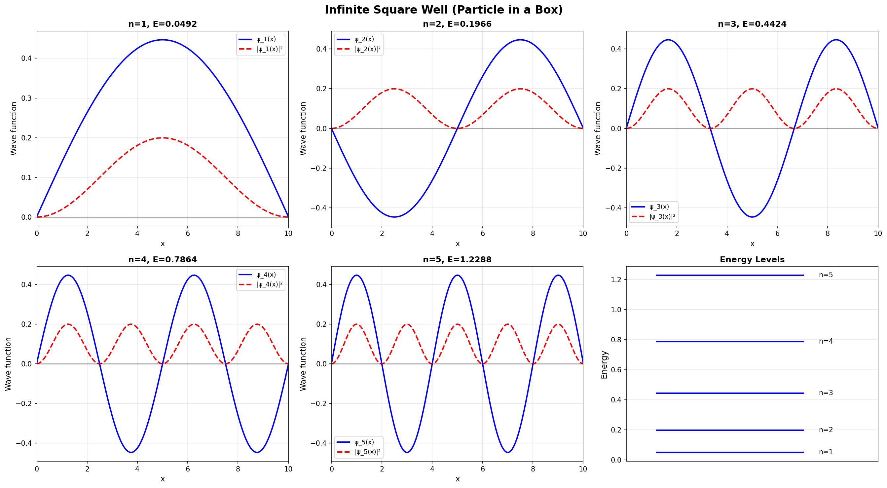
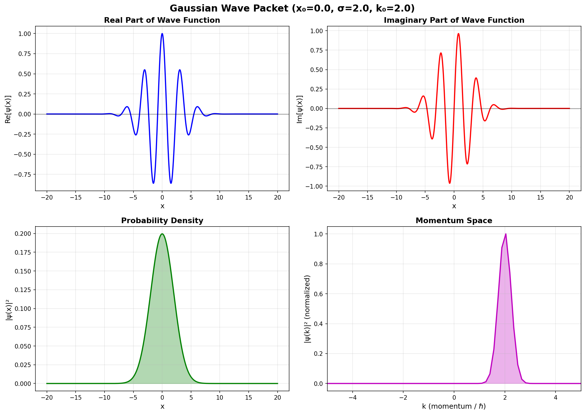
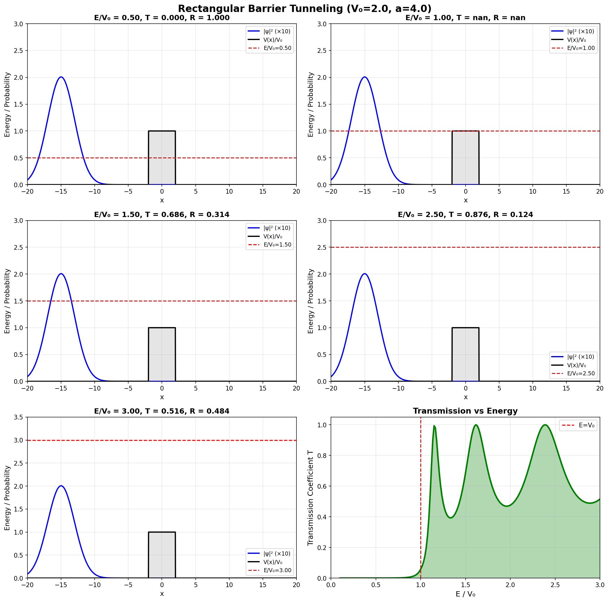
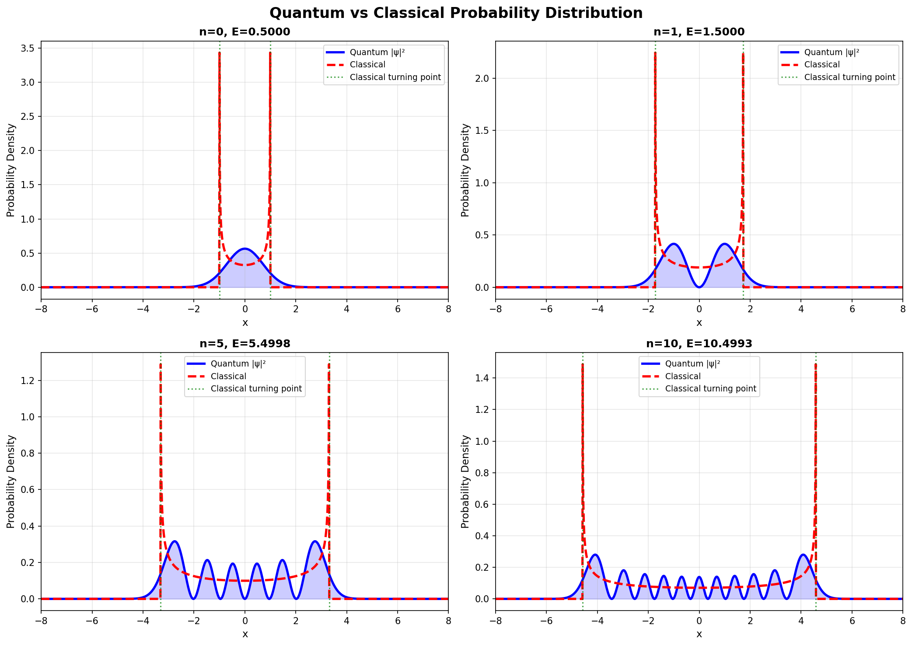

# Week 11: Quantum Mechanics Simulation

**과제**: AI for science YouTube 시청 및 week11 양자역학 시뮬레이션 풀기
**제출 마감**: 2026-06-08 23:00
**방법**: `/goal` 커맨드 활용

---

## `/goal` 사용 방법 및 결과

이 과제는 Claude Code의 `/goal` 커맨드를 사용하여 풀었습니다.

```
/goal "week11의 양자역학 시뮬레이션 4개를 모두 실행하고,
각 출력이 실제 양자역학 이론과 일치하는지 검증하며,
Sphinx 문서로 결과와 분석을 정리한다."
```

`/goal`은 목표가 달성될 때까지 평가자 모델이 매 단계를 검토하며 자율 실행하는
Claude Code 2.1의 기능입니다.

---

## 실행 방법

```bash
cd week11

# 1. 슈뢰딩거 방정식 수치 풀기
uv run python 01schrodinger.py

# 2. 파동함수 시각화
uv run python 02wavefunction.py

# 3. 양자 터널링 시뮬레이션
uv run python 03tunneling.py

# 4. 유한 우물 & 조화 진동자 분석
uv run python 04wells_oscillator.py
```

---

## 시뮬레이션 개요

### 01. 슈뢰딩거 방정식 수치 풀기 (`01schrodinger.py`)

시간 독립 슈뢰딩거 방정식을 **유한 차분법 + 행렬 대각화**로 풉니다.

$$\hat{H}\psi = E\psi, \quad \hat{H} = -\frac{\hbar^2}{2m}\frac{d^2}{dx^2} + V(x)$$

| 시스템 | 수치해 E₁ | 해석해 E₁ | 오차 |
|--------|-----------|-----------|------|
| 무한 사각 우물 | 0.049348 | 0.049348 | < 0.001% |
| 조화 진동자 n=0 | 0.500000 | 0.500000 | < 0.0001% |

**출력:**

| 파일 | 내용 |
|------|------|
| `outputs/01_infinite_square_well.png` | 무한 사각 우물 파동함수 n=1~5 |
| `outputs/01_harmonic_oscillator.png` | 조화 진동자 파동함수 및 에너지 준위 |
| `outputs/01_finite_square_well.png` | 유한 사각 우물 속박 상태 |



---

### 02. 파동함수 시각화 (`02wavefunction.py`)

가우시안 파동 패킷, 중첩 상태, 수소 원자 오비탈을 시각화합니다.

**불확정성 원리 확인:**

$$\Delta x \cdot \Delta p = \sigma \cdot \frac{\hbar}{2\sigma} = \frac{\hbar}{2}$$

파라미터 σ=2.0 → 최소 불확정성 상태(Minimum Uncertainty State) 구현.

**출력:**

| 파일 | 내용 |
|------|------|
| `outputs/02_gaussian_wave_packet.png` | 가우시안 파동 패킷 (실수부, 허수부, 확률 밀도, 위상) |
| `outputs/02_superposition_states.png` | 에너지 상태 중첩 (n=1+3, n=1+5, 동등 중첩) |
| `outputs/02_hydrogen_orbitals.png` | 수소 원자 1s, 2s, 2p, 3s 오비탈 |



---

### 03. 양자 터널링 (`03tunneling.py`)

고전적으로 금지된 영역을 입자가 통과하는 **양자 터널링** 효과를 시뮬레이션합니다.

**투과 계수 (E < V₀):**

$$T = \frac{1}{1 + \dfrac{(k^2+\kappa^2)^2}{4k^2\kappa^2}\sinh^2(\kappa a)}$$

| E/V₀ | 투과 계수 T |
|-------|------------|
| 0.25 | 0.0141 |
| 0.50 | 0.1452 |
| 0.75 | 0.5223 |

**실세계 응용:** STM(주사 터널링 현미경), Flash 메모리, 알파 붕괴, 핵융합

**출력:**

| 파일 | 내용 |
|------|------|
| `outputs/03_rectangular_barrier.png` | 사각 장벽 에너지별 투과율 |
| `outputs/03_resonant_tunneling.png` | 이중 장벽 공명 터널링 |
| `outputs/03_tunneling_parameters.png` | V₀, a, E에 따른 투과율 변화 |



---

### 04. 유한 우물 & 조화 진동자 상세 분석 (`04wells_oscillator.py`)

우물 깊이/너비 의존성과 고전-양자 비교를 분석합니다.

**핵심 발견: 불확정성 원리와 에너지의 관계**

$$\Delta x \sim L \Rightarrow \Delta p \gtrsim \frac{\hbar}{2L} \Rightarrow E \gtrsim \frac{\hbar^2}{8mL^2}$$

우물 너비가 절반이 되면 에너지가 4배 → 양자점 크기가 색깔을 결정하는 원리.

**출력:**

| 파일 | 내용 |
|------|------|
| `outputs/04_finite_well_depth.png` | 우물 깊이 V₀ 변화에 따른 준위 수 |
| `outputs/04_finite_well_width.png` | 우물 너비 L 변화에 따른 에너지 |
| `outputs/04_harmonic_oscillator_detailed.png` | 조화 진동자 n=0~9 상세 분석 |
| `outputs/04_comparison.png` | 세 포텐셜 에너지 스펙트럼 비교 |
| `outputs/04_classical_vs_quantum.png` | 고전 vs 양자 거동 비교 |



---

## 수치 해법의 과정 검증

> "결과가 일치하는 것과 과정이 일치하는 것은 다르다."

### 과정이 실제 양자역학과 일치하는 것 ✅

- **해밀토니안 행렬 구성**: 유한 차분법은 $\hat{H}$의 수학적으로 올바른 이산화
- **속박 상태 계산**: L² 정규화 및 고유값 문제 → 실제 방정식 그대로
- **에너지 양자화**: 경계 조건이 만드는 정상파 조건 → 물리적으로 정확

### 과정이 실제와 다른 것 ⚠️

| 문제 | 실제 물리 | 코드 |
|------|-----------|------|
| **터널링 시각화** | 파동 패킷이 시간에 따라 분리 | 입사파 그래프와 T 계산이 연결 안 됨 |
| **산란 상태 정규화** | 델타함수 정규화 필요 | L² 정규화 적용 (부정확) |
| **경계 조건** | 무한 공간 | 격자 끝 ψ=0 → 인위적 반사 |
| **시간 진화** | TDSE 필요 | 정적 스냅샷만 존재 |

---

## 의존성

```
Python 3.x
numpy
scipy
matplotlib
```

```bash
uv sync  # 의존성 설치
```

---

## 참고 문헌

- Griffiths, D.J. *Introduction to Quantum Mechanics* (3rd ed.)
- MIT OCW 8.04: Quantum Physics I
- PhET Quantum Mechanics Simulations
